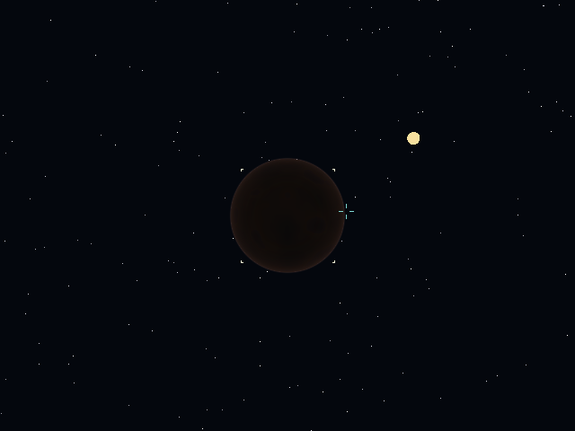
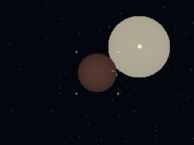

# Apsis Drift

[](https://github.com/gobha-me/apsis-drift/actions/workflows/ci.yml)
[](LICENSE.md)

A deterministic, procedurally generated spaceflight experiment rendered inside
a terminal.

Audio policy is also application-owned. The current
[audio contract](docs/AUDIO.md) provides deterministic tick-addressed cues,
bounded non-blocking delivery, optional RtAudio device output, and a no-device
fallback, plus procedural flight synthesis and the adaptive First Light score
pack. Encoded media uses the validated
[asset provenance contract](docs/ASSET_PROVENANCE.md). The completed
[deterministic MIDI research spike](docs/MIDI_SCORE_SPIKE_2026-08-31.md)
records why the production path uses bounded SMF scheduling and TinySoundFont.

| Direct Kitty, `local` 640x480 | Truecolor ANSI, `remote` 320x240 |
| --- | --- |
|  |  |

Apsis Drift renders a voxel-space landscape into a TermForge `PixelSurface`,
defaulting to 640x480. Kitty-capable terminals receive the full pixel image;
truecolor ANSI terminals receive TermForge's half-block presentation. The game
refuses startup when neither supported presentation is available.

This repository began as a feasibility spike. The renderer is fast enough for
interactive use: the measured direct-Kitty path holds 30 FPS through the
cinematic profile, while the measured RDP path holds 30 FPS at the remote
profile. The dated results and path-specific recommendations are documented in
[the Flight Deck performance envelope](docs/PERFORMANCE_ENVELOPE_2026-08-15.md).
The longer-term direction is documented in [docs/CONCEPT.md](docs/CONCEPT.md).

## Build

Requirements:

- CMake 3.28 or newer
- A C++23 compiler (GCC 13+ or Clang 19+ recommended)
- Git when TermForge must be fetched
- RtAudio platform headers when device output is enabled (`libasound2-dev` on
  Linux)
- FFmpeg when the optional offline MIDI/audition targets and their automated
  loudness/true-peak checks are enabled

Apsis Drift first looks for a TermForge v0.42.0-or-newer package, then for a
compatible sibling checkout at `../termforge`. Older siblings are ignored. If
neither exists, CMake fetches the tagged TermForge v0.42.0 release. This keeps
structured input while adding explicit image invalidation, bounded synchronized
output, built-in driver selection, image residency, placement layers and crops,
and terminal-driven animation registration and payload-free playback control.

```bash
cmake -S . -B build -DCMAKE_BUILD_TYPE=Release
cmake --build build --parallel
ctest --test-dir build --output-on-failure
```

RtAudio 6.0.1 is pinned and enabled by default. Ordinary interactive play
attempts the selected or default output device and falls back to no-device
operation if discovery, open, start, callback, or runtime delivery fails.
Benchmarks, captures, and acceptance tools never probe an audio device. To
build without downloading, compiling, or linking RtAudio:

```bash
cmake -S . -B build -DCMAKE_BUILD_TYPE=Release \
  -DAPSIS_DRIFT_RTAUDIO=OFF
```

The bounded MIDI parser and embedded synth are part of ordinary production
builds. The offline research and First Light audition executables remain
excluded unless `APSIS_DRIFT_MIDI_SPIKE` is enabled:

```bash
cmake -S . -B build-midi -DCMAKE_BUILD_TYPE=Release \
  -DAPSIS_DRIFT_RTAUDIO=OFF -DAPSIS_DRIFT_MIDI_SPIKE=ON
cmake --build build-midi --parallel 2
ctest --test-dir build-midi --output-on-failure \
  -R 'midi-score-spike|first-light-audio'
```

To use a checkout in a different location:

```bash
cmake -S . -B build \
  -DAPSIS_DRIFT_TERMFORGE_SOURCE_DIR=/path/to/termforge
```

## Run

```bash
./build/apsis-drift
./build/apsis-drift --version
```

Interactive runs load the First Light pack from `assets` by default. Use
`--audio-assets PATH` to select an explicit asset root. A missing or invalid
pack fails closed with one diagnostic and leaves the existing procedural audio
path available; benchmark, capture, and acceptance modes never load the pack.

Choose an explicit save profile for an interactive run:

```bash
./build/apsis-drift --new-game-seed 42 --save profile.json
./build/apsis-drift --load profile.json --save profile.json
./build/apsis-drift --load profile.json --save profile-copy.json
```

New-game seeds use the full unsigned 64-bit range, including zero. A profile is
loaded and validated before terminal startup and is written only after a clean
exit. Load failures do not mutate live state, and failed writes before atomic
replacement leave the previous valid profile intact. Fresh profiles begin at
their deterministic Origin Station with authoritative Guided onboarding at
contract one. An ordinary no-option run opens the title menu: New creates a
private local career from a random or edited full-range seed, Assisted or
Advanced Piloting, and Guided or explicitly confirmed Skip onboarding.
Continue and Load revalidate catalog profiles before activation. Skip adds no
mission completions, rewards, discoveries, or world deltas. New writes use save format 16 and record the
writing application version. Releases before v0.8.0 are alpha: formats 1
through 15 are intentionally unsupported after the origin-transfer format-16 reset
and are rejected without
modifying the source file. The durable forward-loading promise begins with the
actual format shipped by v0.8.0; see
[Save Format and Compatibility](docs/SAVE_FORMAT.md).

The local profile catalog and New/Continue/Load title transitions are
implemented; later Save/Save As, dirty-state, and destructive-confirmation
work plus CLI precedence are fixed by the
[Menu and Local Profile Contract](docs/MENU_AND_PROFILE_CONTRACT.md). The
contract keeps profile policy application-owned and preserves the format-16
explicit-path CLI workflow.

Named viewport profiles make the logical render resolution explicit:

| Profile | Viewport |
| --- | ---: |
| `remote` | 320x240 |
| `balanced` | 512x320 |
| `local` (default) | 640x480 |
| `cinematic` | 1024x768 |

The measured conservative defaults are `remote` at 30 FPS through RDP,
`local` at 30 FPS for direct Kitty, and `cinematic` at 30 FPS only as a
direct-path quality mode. The measured RDP playability ceiling is 320x240; the
same workstation's exploratory direct-path probe held a clean 30 FPS through
1280x960. These are starting points rather than universal limits; see the
[dated measurement report](docs/PERFORMANCE_ENVELOPE_2026-08-15.md).

Select a profile or provide a validated custom viewport. The explicit viewport
wins when both options are present:

```bash
./build/apsis-drift --profile cinematic
./build/apsis-drift --viewport 800x600
./build/apsis-drift --profile remote --viewport 640x360
```

Custom viewports are limited to 4096 pixels on either axis and 4,194,304 total
pixels so malformed or runaway dimensions fail before framebuffer allocation.

The cockpit requires an 80x24 terminal. It uses compact instrument rails at
that size and switches to wider bays at 120x32. Smaller terminals withdraw the
pixel viewport and show the required and current dimensions instead of drawing
overlapping or clipped regions.

Interactive controls:

- Startup/pause menus: Up/Down or Tab/Shift-Tab selects an action;
  Enter, Space, or left click activates it
- Arrow keys or W/S: forward/back
- Left/Right or A/D: turn
- Q/E: strafe
- R/F: change flight clearance
- Space: toggle autopilot
- Signal navigation mode: Tab/Shift-Tab selects the next/previous target
- Signal Run: accept the local briefing and launch into a repeatable physical
  flight check. Enter redocks inside the inclusive 5 km / 25 m/s boundary,
  refuses a too-fast in-envelope transition, and starts home Planetfall only
  outside the docking envelope. Follow the actual station bearing, elevation,
  range, closing, edge cue, and action label; collect the bound target, ascend,
  rendezvous, dock, and explicitly turn in
- Origin-system contract: accept contract two after the Signal Run, depart the
  station and press Enter to begin the bound non-FTL transfer; use `[`/`]` for
  1x/4x/16x, follow ETA/relative-speed/braking cues, and press Enter only at
  `ORBIT RDY`. Complete the bound signal, ascend and press Enter to depart,
  intercept the home approach, rendezvous with the moving station, dock, and
  turn in.
- First intersystem contract: after contracts one and two, accept and launch
  at the mission board, fly freely around the moving Origin Station, press U
  for the bounded universe view, use Tab/Shift-Tab and Enter to select TARGET,
  then press J to begin or cancel the three-second FTL spool. Committed transit
  arrives automatically after two seconds. Press Enter within the rendezvous
  boundary to redock before jumping.
- Penalty mode: New Game chooses Assisted or Advanced Piloting once for the
  career; this is separate from the cockpit's Manual/Autopilot control
- Advanced FTL spool: use A/D to correct heading and W/S to correct velocity;
  the cockpit shows signed error, projected ALIGNED/OFFSET/OPPOSED quality, and
  the next correction before J can still cancel the spool
- Advanced atmospheric entry: watch `HEAT`, `TEMP`, `FPA`, and the textual cue;
  slow and rise while heating. At 100%, `ABRT CLMB` forces a deterministic
  climb to orbit, clears held descent, cools the craft, and permits another
  entry. Assisted shows the same feedback without forcing the climb.
- Target-system flight: W/S thrust or brake, A/D turn, Q/E strafe, R/F rise
  or fall, Space toggles direct target assist, and `[`/`]` selects 1x/4x/16x
  time compression outside the six-radius approach boundary; the cockpit shows
  the active mode, time scale, and approach cue. Press Enter only when it
  reports `ORBIT RDY`; an early attempt lists every unmet insertion threshold.
- Planet return: ascend to the orbital regime and press Enter to depart the
  planet; after completing the objective, use U to select ORIGIN, then press J
  in target-system flight to spool the home jump
- Origin return: follow the explicit Origin Station range and closing cues,
  then press Enter at `ENTER DOCK`; turn in the contract from the station board
- Complete-loop verification: `--intersystem-contract-acceptance` replays the
  fixed station-to-system contract and its save/resume matrix without terminal
  timing entering authoritative state
- Left-button hold in the exterior viewport: forward/back and turn
- Right-button hold in the exterior viewport: strafe and change flight clearance
- Middle-button click in the exterior viewport: toggle autopilot
- Escape during flight: pause
- Escape while paused: resume

The game opens on a title screen with explicit Continue and Exit actions.
Continue enters the Origin Station for docked profiles and resumes the cockpit
for in-flight profiles. Escape never exits active flight or the title screen. While paused, fixed-step
simulation does not advance, accumulated host time is discarded, and held
keyboard or mouse controls are reconciled before the first resumed tick. The
menu keeps textual focus markers and cell-native action labels on both Kitty
and supported truecolor ANSI paths. Ctrl-C remains the terminal interrupt path.

The complete v0.4 objective and deterministic save/resume acceptance path are
documented in [docs/SIGNAL_RUN.md](docs/SIGNAL_RUN.md).

The v0.4.3 acceptance matrix completes the objective on airless, temperate,
and dense worlds, bounds atmosphere-to-terrain descent to 120 seconds, and
holds forward descent over generated terrain for 120,000 ticks to verify the
16 metre contact floor. Atmospheric approaches now add pressure-aware sky
gradation and horizon haze while airless worlds remain haze-free. Its
fixed-seed solar checkpoints verify visible, planet-occluded, and re-emerged
sun states plus exact geometry/framebuffer reproduction after save/reload.

The next station-to-system loop is grounded in a versioned
[intersystem mission and travel contract](docs/INTERSYSTEM_CONTRACT.md). It
reserves stable origin, destination, star, planet, orbit, and mission streams;
defines one authoritative universe clock; and proves the legal outbound,
planet-side, return, docking, and turn-in phases consumed by the local-system
presentation and later travel mechanics.

The v0.4.5 local-system generator now resolves that destination into a stable
star and ordered three-to-six-planet catalog. Independent ordinal seeds preserve
the existing mission planet and terrain, while circular inclined ephemerides
produce bounded system-frame positions and velocities from authoritative time.
The exact generator and diagnostic contract is documented in
[docs/LOCAL_SYSTEM_GENERATION.md](docs/LOCAL_SYSTEM_GENERATION.md).

The v0.4.6 local-system presentation renders that star and every moving planet
from explicit analytic ephemeris time. A stable selected planet has graphical
brackets plus textual bearing, elevation, range, and closing/opening cues on
both Kitty and ANSI paths. Angular-size impostors blend into the existing
orbital planet renderer during approach without changing target identity. The
projection, overlap, handoff, and measurement rules are documented in
[docs/SYSTEM_RENDERING.md](docs/SYSTEM_RENDERING.md).

The v0.4.7 Origin Station mission board binds one deterministic mission,
target system, planet, and existing surface-signal objective. Its semantic
briefing and acceptance state are shared by Kitty and ANSI, persist in save
format 7, and launch into the deterministic Assisted FTL transit and sub-light
target approach. The exact mission-board boundaries are documented in
[docs/MISSION_BOARD.md](docs/MISSION_BOARD.md).

The v0.4.8 jump binds its destination, arrival tick, position, and velocity at
commitment, then presents the same bounded five-second sequence through Kitty,
ANSI, or headless execution. See
[docs/INTERSYSTEM_JUMP.md](docs/INTERSYSTEM_JUMP.md).

The v0.4.9 target-system flight begins from that immutable arrival solution,
then advances bounded inertial thrust and moving-planet interception at 120 Hz.
It supplies explicit closing, ETA, braking, compression, and insertion cues,
and preserves arrival side and heading when handing off to the existing
orbital path. See [docs/SYSTEM_FLIGHT.md](docs/SYSTEM_FLIGHT.md).

The v0.4.10 planetary handoff derives local terrain reach from clearance,
camera pitch, field of view, and viewport aspect. Nearby samples retain fine
detail while distant samples use screen-bounded steps and coarser LODs. Any
spherical surface not yet covered by the local pass remains visible, preventing
sky-only frames through the 2,500-to-2,000 metre blend. See
[docs/PLANETARY_PRESENTATION.md](docs/PLANETARY_PRESENTATION.md).

The v0.4.11 target Planetfall path keeps orbit insertion on the actual arrival
side, permits descent from any longitude, and treats the mission marker as
guidance rather than an entry gate. Real terrain sampling, scanner navigation,
collection dwell, the immutable mission target, and the sparse collected delta
advance transactionally and resume from save format 6. See
[docs/INTERSYSTEM_PLANETFALL.md](docs/INTERSYSTEM_PLANETFALL.md).

The v0.4.12 return path reverses the planet-fixed handoff from any orbital
longitude, preserves the collected world delta through a cancelable home-jump
spool, and arrives 40 km from the Origin Station rendezvous corridor.
Station-relative guidance, a 5 km rendezvous predicate, explicit docking
confirmation, and idempotent mission turn-in resume from save format 7. See
[docs/INTERSYSTEM_RETURN.md](docs/INTERSYSTEM_RETURN.md).

The v0.4.29 complete-contract acceptance path composes mission acceptance,
origin free flight, redocking, canceled and resumed outbound spool, the moving
target system, Planetfall, recovery from a poor entry, orbital return, home
transit, docking, and turn-in. Nine independent save/resume continuations
converge on one authoritative final checksum under
GCC and Clang, while application framebuffer, TermForge encoding, and live
terminal/proxy timings remain separate evidence. See
[docs/INTERSYSTEM_CONTRACT_ACCEPTANCE.md](docs/INTERSYSTEM_CONTRACT_ACCEPTANCE.md).

The v0.4.30 local-profile contract fixes bounded catalog storage, metadata,
ordering, dirty-state, confirmation, concurrency, and CLI-precedence behavior
before the title and pause flows expand. It preserves explicit format-16 paths
and keeps profile policy in Apsis Drift. See
[docs/MENU_AND_PROFILE_CONTRACT.md](docs/MENU_AND_PROFILE_CONTRACT.md).

The v0.4.31 onboarding state adds the authoritative Guided, Skipped, and
Completed career states with exact contract-one-through-three chapters.
Guided is the New Game default; Skip exposes the post-onboarding navigation
baseline without changing generated truth or fabricating history. Save format
14 introduced the onboarding alpha reset and is superseded by the current
home-contract reset. See
[docs/ONBOARDING.md](docs/ONBOARDING.md).

The v0.4.32 Guided contract one binds one deterministic home-planet Signal
Run, begins with an optional action-observing station flight check, crosses the
existing planetary regimes, and ends only after physical ascent, moving-station
rendezvous, docking, and explicit turn-in. Eight save/resume boundaries, three
Assisted seeds, and a bounded Pilot thermal run form its renderer-neutral
acceptance matrix. Save format 15 recorded the stable local contract/target
binding and resets formats 1 through 14 explicitly. See
[docs/SIGNAL_RUN.md](docs/SIGNAL_RUN.md).

The v0.4.33 Guided contract two binds an independently seeded, distinct body
and one existing signal-survey objective in the origin system. The player
physically departs, intercepts the moving target under authoritative time
compression, completes the objective, returns through the home-planet
approach, rendezvouses with the moving station, docks, and turns in. Seven
canonical save/resume boundaries and cadence-independent checksums prove the
round trip. Save format 16 records the contract and bounded origin-system
knowledge while explicitly rejecting formats 1 through 15. See
[docs/ORIGIN_SYSTEM_CONTRACT.md](docs/ORIGIN_SYSTEM_CONTRACT.md).

The v0.4.34 universe-navigation contract gives the origin and authored first
target independent fixed-point anchors, separates generated truth from
CONTACT/PROBABLE/RESOLVED/VISITED knowledge, and defines valid, authorized,
affordable, available, and selectable route status. Its executable seed-42
proof compares the existing five-second FTL path with a continuous physical
boundary-to-boundary cruise while keeping save, renderer, and terminal evidence
separate. See
[docs/UNIVERSE_NAVIGATION.md](docs/UNIVERSE_NAVIGATION.md).

The v0.4.35 first-jump onboarding path turns that contract into the bounded
contract-three cockpit flow. Guided careers receive the offer only after the
origin-system transfer is turned in, route selection is explicit before each
spool, cancellation preserves the live craft, and only station turn-in marks
onboarding completed. See
[docs/FIRST_JUMP_ONBOARDING.md](docs/FIRST_JUMP_ONBOARDING.md).

The v0.4.36 title flow adds New, Continue, Load, Settings information, and Exit
with keyboard and mouse parity. New persists a bounded local career before
activation, uses OS entropy for rerollable universe seeds, and locks Assisted
or Advanced Piloting for the career. Guided remains the default, while Skip
requires a separate cancel-first confirmation. See
[docs/MENU_AND_PROFILE_CONTRACT.md](docs/MENU_AND_PROFILE_CONTRACT.md).

The v0.4.37 Guided departure clarification makes the first post-launch Enter
unambiguous: safe in-envelope input explicitly redocks, excessive relative speed
is refused, and home Planetfall begins only outside 5 km. The cockpit exposes
actual camera-relative station bearing and elevation plus a stable off-screen
edge cue. A driver-backed acceptance trace proves the application keeps running
through both redock and Planetfall under Kitty and ANSI. See
[docs/SIGNAL_RUN.md](docs/SIGNAL_RUN.md).

The v0.4.38 onboarding acceptance carries one format-16 Guided career through
all three physical contracts for seeds 1, 42, and 0xC0FFEE, then proves the
open-exploration handoff and identical-world/no-history Skip baseline. The
Kitty/ANSI report keeps authoritative checksums, application framebuffer,
encoded bytes, and external terminal throughput distinct. See
[docs/ONBOARDING_ACCEPTANCE.md](docs/ONBOARDING_ACCEPTANCE.md).

The v0.4.14 rule-profile contract added an authoritative, save-backed Assisted
or Advanced penalty mode. New Game now locks that mode for the career;
runtime Manual/Autopilot remains a separate cockpit control. Assisted remains
the complete-loop default; Advanced records deterministic thermal-abort and
alignment-quality boundaries. The internal format-16 token remains `pilot` for
wire compatibility. See
[docs/RULE_PROFILES.md](docs/RULE_PROFILES.md).

The v0.4.15 Pilot FTL path turns that selection into a fixed-point alignment
task. Commitment grades an immutable ALIGNED, OFFSET, or OPPOSED handoff;
Assisted retains its exact ten-radius matched-velocity corridor, while poor
Pilot execution changes only the recoverable target-system approach. Save
format 16 retains the alignment and placement exactly. See
[docs/INTERSYSTEM_JUMP.md](docs/INTERSYSTEM_JUMP.md).

The v0.4.17 Pilot reentry path derives thermal load from atmospheric pressure,
altitude, total speed, descent angle, and fixed-step time. Fixed-point load and
the Pilot abort latch are authoritative save state; trend, flight-path angle,
and correction cues are derived cockpit presentation. Assisted retains the
same mission path and feedback without enforcing the limit. Pilot reaches one
bounded consequence at 100%: a forced skip-out to orbit that cools, releases
held descent, and allows a deliberate retry. See
[docs/PILOT_REENTRY.md](docs/PILOT_REENTRY.md).

The v0.4.18 headless path constructs the requested TermForge encoder instead
of labeling Kitty output as ANSI. Ordinary benchmark JSON records the active
`kitty`, `ansi`, or diagnostic `fallback` presentation, and system-navigation
acceptance rejects any mismatch between the requested and exercised driver.
Application framebuffer checksums remain independent of the encoder; byte
totals now describe the actual encoded stream.

The v0.4.19 renderer-only acceptance paths no longer copy a requested
Kitty/ANSI label into reports without exercising that encoder. Intersystem,
system-flight, and Signal Run reports now identify their evidence as
`application_framebuffer`; the headless benchmark and system-navigation
acceptance remain the encoder-backed Kitty/ANSI checks.

The v0.4.20 jump boundary resolves and validates the complete deterministic
arrival before atomically publishing commitment. Committed, target-flight,
return-spool, and origin-return saves require that immutable solution; missing
or altered destination, reference, tick, assessment, pose, or velocity data is
rejected before gameplay or save commit instead of creating a stranded jump.

The v0.4.21 authoritative clock prevents raw batch advances from crossing the
fixed outbound or return spool and transit boundaries. Exact-boundary advances
remain valid so the one-tick jump owner can reach them and commit or arrive
atomically, while late transitions and cross-boundary batches reject without
mutation.

The v0.4.22 planetary validator rejects flight regimes outside their documented
altitude or clearance bands and accepts only adjacent regime-transition
telemetry. Save loading and orbit departure share that contract, so changing a
near-surface craft's regime label cannot bypass ascent into system flight.

The v0.4.23 system-flight clock rechecks the six-radius approach boundary after
every authoritative compressed substep. A host step that reaches the boundary
stops immediately at 1x, so approach and insertion space cannot be skipped.

The v0.4.24 legacy Signal Run loader regenerates the bounded signal catalog
before returning a decoded save. Unknown targets, discoveries, world deltas,
and inconsistent objective or tick relationships now fail with a precise save
path instead of reaching a generic application hydration exception.

The v0.4.25 flight-step APIs accept only the authoritative 120 Hz duration.
Legacy and planetary motion, including thermal integration, use the shared
`kSimulationStep`; invalid or near-miss durations reject without advancing the
tick or mutating flight state.

The v0.4.27 format-11 reset establishes the pre-v0.8 alpha policy explicitly.
It added bounded writer-version provenance and gave formats 1 through 10 a
distinct unsupported-alpha diagnostic before authoritative fields were
decoded; rejected files remain byte-for-byte untouched. The
[release checklist](docs/RELEASING.md) records the v0.8+ beta and 1.x
forward-loading promises.

The v0.4.28 orbiting-home boundary gives origin planet zero a versioned,
tutorial-safe role without changing its seed or any unrelated stream. The
Origin Station now has a deterministic circular orbit around that planet;
return arrival, rendering, guidance, save/resume, and docking all use the same
tick-resolved position and velocity. Save format 12 stores the home/orbit
recipe and station-relative approach state and intentionally rejects formats
1 through 11 without touching the source file.

The v0.4.29 origin-flight path launches into a deterministic station-relative
craft state instead of jumping from a fixed camera. Normal flight controls,
guidance, assist, and bounded docking work before the outbound jump; Pilot
alignment begins from the live craft yaw and relative speed. Outbound spooling
freezes that exact state so cancellation and format-16 save/resume restore the
same craft without rerolling identities or advancing another random stream.

| Kitty-scale local profile | ANSI-scale remote profile |
| --- | --- |
|  |  |

These deterministic application-framebuffer captures use the logical
viewports consumed by the Kitty and ANSI paths; the encoder-backed driver smoke
matrix remains separate from renderer evidence.

The title uses an original code-authored bitmap alphabet and palette with
integer scaling; it does not load an encoded font or image asset. Its exact
glyph coverage, origin, and license are recorded in
[docs/ASSET_PROVENANCE.md](docs/ASSET_PROVENANCE.md).

Mouse flight divides each viewport axis into thirds. The center third is a
dead zone; the outer thirds select the corresponding direction, and diagonal
holds combine both axes. Release and press again in another zone to change the
mouse direction. Keyboard and mouse holds are tracked independently,
so releasing one does not cancel the other. Opposing directions cancel to a
neutral axis. Button release, leaving the exterior viewport, resize, or input
loss neutralizes mouse-owned controls without clearing keyboard holds. A
terminal without suitable mouse reporting therefore remains fully playable by
keyboard.

Orbital translation preserves momentum when its input is released. Apply
opposing thrust to brake before arrival; atmospheric and terrain flight retain
their assisted deceleration. The cockpit distinguishes thrust, coast, and
braking, and reports total craft speed, signed target closing speed, arrival
estimate, and an explicit braking cue.

Input is converted to tick-addressed simulation commands. Apsis Drift requires
semantic keyboard press, repeat, and release events, supplied by TermForge
through the enhanced terminal keyboard protocol or an explicitly configured
structured event source. High-frequency pointer changes are coalesced to
bounded per-tick intent. A mouse autopilot toggle is applied before manual
commands at the same tick, so simultaneous keyboard or held mouse input returns
to manual flight.
Any manual-control press disengages autopilot. Apsis Drift does not scan or open
raw input devices; terminal protocols, device permission, focus, layout, and
degradation policy remain outside the game.

The cockpit reports heading in normalized degrees, altitude and requested
terrain clearance in world units, and total craft speed. Target guidance keeps
bearing separate from signed closing speed and arrival estimate. The flight
rail reports manual or autopilot mode plus current thrust/coast state.
Clearance at or below 24 units
raises a textual `LOW CLR` warning; invalid numeric telemetry is shown with
fixed-width dashes and a `TELEM ERR` warning so neither condition relies on
color alone.

Flight simulation advances at a fixed 120 Hz independently of rendering. Host
stalls contribute at most 125 ms of catch-up work per frame; excess elapsed
time is discarded instead of creating an unbounded simulation backlog.

Diagnostic capability forcing can exercise the supported paths and startup
refusals independently:

```bash
./build/apsis-drift --driver kitty
./build/apsis-drift --driver ansi
./build/apsis-drift --driver ansi --keyboard press-only
./build/apsis-drift --driver fallback
```

An explicit driver defaults to enhanced input; `--keyboard press-only` isolates
the missing-repeat/release refusal. The fallback choice exists only to verify
missing-truecolor refusal. Unsupported combinations exit nonzero before the
title menu or alternate-screen entry. After exit, the application prints the
selected display tier and effective input capabilities. Forcing skips the
startup probe and is diagnostic; it cannot make an unsupported terminal
implement a protocol.

## Flight Deck acceptance run

The v0.2 Flight Deck has one application-owned acceptance scenario. It fixes
the terrain seed at `12648430`, applies 18 tick-addressed commands over 240
simulation ticks, renders the final cockpit state for visual inspection, and
writes a versioned JSON report. The fixed seed cannot be overridden in this
mode.

From a clean build, run the complete automated matrix, including Kitty,
truecolor ANSI, missing-truecolor refusal, and missing key-release refusal:

```bash
cmake -S . -B build -DCMAKE_BUILD_TYPE=Release
cmake --build build --parallel
ctest --test-dir build --output-on-failure
```

Run either supported presentation directly to retain its acceptance report:

```bash
./build/apsis-drift --flight-deck-acceptance \
  --driver kitty --profile local --report flight-deck-kitty.json
./build/apsis-drift --flight-deck-acceptance \
  --driver ansi --profile remote --report flight-deck-ansi.json
```

The command schedule is: toggle autopilot off and press forward at tick 0;
press right at 18; press left at 36; press right strafe at 48; release right at
60; release left at 72; press rise at 84; release right strafe at 96; release
rise at 108; press backward at 120; release forward at 132; press left strafe
at 144; press fall at 156; release backward at 168; release left strafe at
180; release fall at 192; and toggle autopilot on at 204. The run ends at tick
240 with all manual controls neutral.

Both presentations must report the flight checksum
`15302063256845754841`. The captured 2026-08-15 workstation produced final
framebuffer checksums
`14472657128233142808` for the `local` Kitty run and
`4248103746500193130` for the `remote` ANSI run. Framebuffer checksums include
presentation-only floating-point camera pitch and can vary with the host math
library; reports retain them as same-environment visual diagnostics, not
cross-machine acceptance values. Timing and encoded-byte totals are likewise
presentation measurements. The final simulation state remains visible for
roughly ten seconds so the cockpit, instruments, and presentation quality can
be inspected or captured.

## Planetfall acceptance run

The v0.3 Planetfall scenario advances one generated craft continuously from
orbit to a volcanic terrain flyover. It fixes planet seed `42`, starts over a
canonical Carayx highland at latitude `0.625` and longitude `-pi/4`, applies
four tick-addressed commands over `30089` fixed simulation ticks, and records
orbital, atmospheric, terrain-blend, and local-terrain checkpoints.

Run the deterministic remote and local profiles directly:

```bash
./build/apsis-drift --planetfall-acceptance \
  --profile remote --report planetfall-remote.json
./build/apsis-drift --planetfall-acceptance \
  --profile local --report planetfall-local.json \
  --snapshot planetfall-local.ppm
```

Both profiles and both compiler builds must report the final authoritative
flight checksum `15251675909814434464` and the same ordered stage ticks `0`,
`4080`, `15555`, and `30089`. Timing fields and framebuffer checksums remain
presentation diagnostics; they do not enter deterministic simulation state.
Planetary frames derive their terminator, atmospheric daylight, visible sun,
and terrain day/night from one seed- and tick-owned ten-minute solar cycle;
night-side and airless skies retain deterministic stars.
The v0.3.1 local profile keeps the canonical 640x480 terrain-blend checkpoint
below the 33.33 ms application-renderer budget by bounding tile-backed orbital
sampling and omitting raster passes that cannot affect an 8-bit pixel.
The exact command schedule, report contract, stage identities, and measured
profile envelope are documented in the
[Planetfall acceptance path](docs/PLANETFALL_ACCEPTANCE.md).

Run the deterministic cockpit signal approach through both supported terminal
presentations:

```bash
./build/apsis-drift --signal-navigation-acceptance \
  --driver ansi --profile remote --report signal-navigation-ansi.json
./build/apsis-drift --signal-navigation-acceptance \
  --driver kitty --profile local --report signal-navigation-kitty.json
```

Both routes select the same generated signal, reach it at tick `1072`, finish
the acquisition and scan dwell at tick `1491`, and emit one persistent
`collected` delta. They produce authoritative flight checksum
`17407832030238464473`. Fixed-width navigation, progress, abort, and completion
cues are shared by Kitty and ANSI. The exact visibility and collection rules
are documented in the [signal navigation contract](docs/SIGNAL_NAVIGATION.md)
and [signal collection contract](docs/SIGNAL_COLLECTION.md).

## Measure and capture

Run the deterministic headless benchmark:

```bash
./build/apsis-drift --benchmark 180
./build/apsis-drift --benchmark 180 --driver ansi --report ansi.json
./build/apsis-drift --benchmark 180 --driver kitty --report kitty.json
./build/apsis-drift --benchmark 1 --snapshot landscape.ppm
./build/apsis-drift --benchmark 1 --profile cinematic
./build/apsis-drift --benchmark 1 --profile local \
  --workload orbital --snapshot orbital.ppm
```

The benchmark measures CPU-side rendering and TermForge submission. It does not
measure terminal, PTY, proxy, or display performance. Its frame clock is
synthetic, so simulation follows the same fixed-step path without sleeping or
mixing wall-clock jitter into deterministic framebuffer checksums.
Headless `automatic` deterministically selects Kitty, preserving the sweep and
ordinary benchmark default. Explicit `kitty`, `ansi`, and diagnostic
`fallback` choices construct those drivers directly; the JSON `presentation`
field and encoded-byte totals identify the active path. Fallback remains an
unsupported interactive tier and is available headlessly only for degradation
tests.
Ordinary and capture report schema 1 encodes `checksum` and `total_bytes` as
canonical decimal strings so 64-bit values round-trip through JSON consumers
such as JavaScript without precision loss. Sweep schema 2 and system-navigation
schema 2 use the same string representation, including the latter's nested
benchmark summary. Historical checked-in performance reports are retained in
their original schemas rather than silently rewritten.
The optional `orbital` workload renders the generated planet with a
deterministic moving camera, while `system` renders the generated star and
moving multi-planet catalog; `landscape` remains the default. Workload
selection is available only in benchmark and sweep modes. Run the complete
fixed-seed cockpit matrix with
`--system-navigation-acceptance --driver kitty|ansi --report PATH`.
The deterministic Assisted-jump matrix is available through
`--intersystem-jump-acceptance --report PATH`.
Run the complete first-contract matrix with
`--intersystem-contract-acceptance --report PATH`; add
`--snapshot PATH` for the bounded final Origin Station frame.
Prove the Guided contract-one departure interaction through the shipped input
and encoder paths with `--guided-departure-acceptance --driver kitty|ansi`,
plus `--profile local|remote --report PATH`.
Run the composed station-to-universe career with
`--onboarding-acceptance --driver kitty|ansi --profile local|remote
--report PATH`.
Generate the renderer-neutral universe-route, direct-cruise, and projected-save
evidence with
`--universe-navigation-acceptance --report PATH`. Contract-three presentation
work must add its application-renderer and terminal-path evidence separately.

Run a repeatable resolution and target-cadence sweep and retain its JSON report:

```bash
./build/apsis-drift --sweep 180 --report landscape-sweep.json
./build/apsis-drift --sweep 180 \
  --sweep-viewports remote,640x360,local,cinematic \
  --sweep-fps 24,30,60 \
  --seed 12648430 \
  --report landscape-sweep.json
./build/apsis-drift --sweep 60 --sweep-viewports remote,local \
  --sweep-fps 30,60 --seed 42 --workload orbital \
  --report orbital-sweep.json
```

The default sweep covers the remote, balanced, and local profiles at 30 and 60
FPS. Each viewport is measured once at full headless throughput; target FPS
values calculate deadline headroom and required wire throughput without
sleeping or changing the simulated workload. The versioned JSON records the
explicit seed and frame count. Repeated runs can compare ordered profile
identities and checksums while treating timing values as machine-dependent.

For an end-to-end Kitty measurement on the real terminal path:

```bash
./build/apsis-drift --capture-seconds 60 --report landscape-capture.json
```

Capture mode forwards every frame to the terminal, so its achieved cadence
includes the PTY/proxy/terminal path. It bypasses the title menu and exits after
the requested duration.

## Measured Flight Deck envelopes

The 2026-08-15 live matrix measured every named profile for 60 seconds:

| Path | Remote | Balanced | Local | Cinematic |
| --- | ---: | ---: | ---: | ---: |
| Direct Kitty | 30.70 FPS | 30.72 FPS | 30.73 FPS | 30.72 FPS |
| Kitty over RDP | 30.29 FPS | 20.44 FPS | 21.24 FPS | 6.42 FPS |

The paired GCC and Clang headless sweeps kept cinematic complete-frame p95
below 10 ms, separating CPU-side renderer capacity from the much larger RDP
presentation tails. The full methodology, timing distributions, environment
details, limitations, and raw JSON are in the
[dated performance envelope](docs/PERFORMANCE_ENVELOPE_2026-08-15.md).

Headless benchmark runs temporarily use `/dev/null` for stdin. This works
around [TermForge issue #256](https://github.com/gobha-me/termforge/issues/256),
where `test_run_frames()` can block on a cooked terminal's stdin.

## Project boundaries

- Apsis Drift owns terrain and world generation, flight, simulation, cockpit,
  saves, and game-specific rendering.
- TermForge owns terminal protocols, structured event sources, input capability
  detection, degradation, presentation, and general frame instrumentation.
- RasterForge enters only when reusable raster asset decoding, fitting,
  resizing, or compositing becomes a demonstrated need.

The goal is to build a small game that reveals useful abstractions, not to
begin by inventing a generic 3D engine.

## Roadmap

Development is organized around playable milestone outcomes. Implementation
issues are deliberately sized for one focused session and include explicit
acceptance criteria, verification, and dependencies. Epic issues track the
milestones; they are not implementation sessions themselves.

- [v0.2 — Flight Deck](https://github.com/gobha-me/apsis-drift/issues/33)
- [v0.3 — Planetfall](https://github.com/gobha-me/apsis-drift/issues/34)
- [v0.4 — Signal Run](https://github.com/gobha-me/apsis-drift/issues/35)
- [v0.5 — First Light](https://github.com/gobha-me/apsis-drift/issues/36)
- [First intersystem contract loop](https://github.com/gobha-me/apsis-drift/issues/91)
  — complete in v0.4.13

The v0.4 loop is grounded in the deterministic
[origin-station and new-game contract](docs/ORIGIN_STATION.md), which defines
the zero-discovery start and first-objective handoff used by the completed
Signal Run. Its generated objectives follow the versioned
[surface-signal contract](docs/SURFACE_SIGNALS.md), which keeps immutable
placement and metadata separate from later discovery and mission state. The
[signal navigation contract](docs/SIGNAL_NAVIGATION.md) adds deterministic
selection and cockpit guidance without crossing that mutable-state boundary.
The [sparse generated-world journal](docs/WORLD_DELTAS.md) layers compact
discovery and terminal object state onto regenerated catalogs without storing
terrain or cache contents.
The [intersystem contract](docs/INTERSYSTEM_CONTRACT.md) extends those stable
boundaries to the first generated destination and explicit return loop.

New work should use the session-sized issue form. If implementation uncovers
additional work, record it as a follow-up issue instead of silently expanding
the active session.

## License

Code is available under the [BSD 3-Clause License](LICENSE.md). The optional
RtAudio license notice is recorded in
[THIRD_PARTY_NOTICES.md](THIRD_PARTY_NOTICES.md). Generated or third-party
media assets may carry their own provenance and license metadata.
