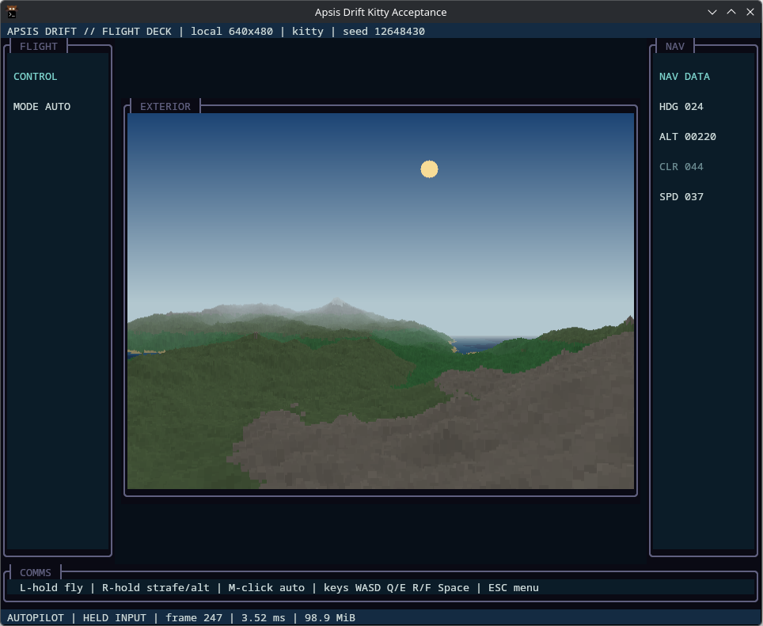
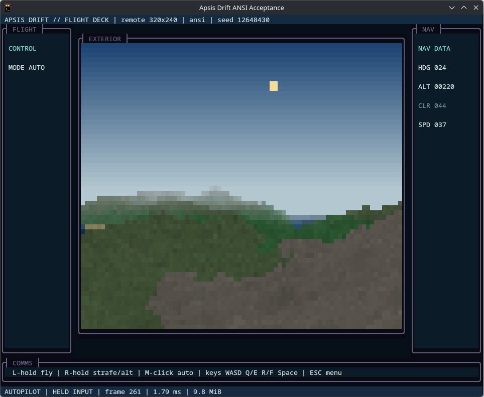

# Apsis Drift

[](https://github.com/gobha-me/apsis-drift/actions/workflows/ci.yml)
[](LICENSE.md)

A deterministic, procedurally generated spaceflight experiment rendered inside
a terminal.

| Direct Kitty, `local` 640x480 | Truecolor ANSI, `remote` 320x240 |
| --- | --- |
|  |  |

Apsis Drift renders a voxel-space landscape into a TermForge `PixelSurface`,
defaulting to 640x480. Kitty-capable terminals receive the full pixel image;
truecolor ANSI terminals receive TermForge's half-block presentation. The game
refuses startup when neither supported presentation is available.

This repository began as a feasibility spike. The renderer is fast enough for
interactive use: the measured direct-Kitty path holds 30 FPS through the
cinematic profile, while the measured RDP path holds 30 FPS at the remote
profile. The dated results and path-specific recommendations are documented in
[the Flight Deck performance envelope](docs/PERFORMANCE_ENVELOPE_2026-08-15.md).
The longer-term direction is documented in [docs/CONCEPT.md](docs/CONCEPT.md).

## Build

Requirements:

- CMake 3.28 or newer
- A C++23 compiler (GCC 13+ or Clang 19+ recommended)
- Git when TermForge must be fetched

Apsis Drift first looks for a TermForge v0.42.0-or-newer package, then for a
compatible sibling checkout at `../termforge`. Older siblings are ignored. If
neither exists, CMake fetches the tagged TermForge v0.42.0 release. This keeps
structured input while adding explicit image invalidation, bounded synchronized
output, built-in driver selection, image residency, placement layers and crops,
and terminal-driven animation registration and payload-free playback control.

```bash
cmake -S . -B build -DCMAKE_BUILD_TYPE=Release
cmake --build build --parallel
ctest --test-dir build --output-on-failure
```

To use a checkout in a different location:

```bash
cmake -S . -B build \
  -DAPSIS_DRIFT_TERMFORGE_SOURCE_DIR=/path/to/termforge
```

## Run

```bash
./build/apsis-drift
```

Choose an explicit save profile for an interactive run:

```bash
./build/apsis-drift --new-game-seed 42 --save profile.json
./build/apsis-drift --load profile.json --save profile.json
./build/apsis-drift --load profile.json --save profile-copy.json
```

New-game seeds use the full unsigned 64-bit range, including zero. A profile is
loaded and validated before terminal startup and is written only after a clean
exit. Load failures do not mutate live state, and failed writes before atomic
replacement leave the previous valid profile intact. Fresh profiles begin at
their deterministic Origin Station; in-flight profiles restore the exact
planetary craft, objective, discoveries, and compact world-delta journal.
New writes use save format version 2 and record local-sun generator
compatibility. Version 1 profiles load normally and migrate to version 2 on
their next explicit save.

Named viewport profiles make the logical render resolution explicit:

| Profile | Viewport |
| --- | ---: |
| `remote` | 320x240 |
| `balanced` | 512x320 |
| `local` (default) | 640x480 |
| `cinematic` | 1024x768 |

The measured conservative defaults are `remote` at 30 FPS through RDP,
`local` at 30 FPS for direct Kitty, and `cinematic` at 30 FPS only as a
direct-path quality mode. The measured RDP playability ceiling is 320x240; the
same workstation's exploratory direct-path probe held a clean 30 FPS through
1280x960. These are starting points rather than universal limits; see the
[dated measurement report](docs/PERFORMANCE_ENVELOPE_2026-08-15.md).

Select a profile or provide a validated custom viewport. The explicit viewport
wins when both options are present:

```bash
./build/apsis-drift --profile cinematic
./build/apsis-drift --viewport 800x600
./build/apsis-drift --profile remote --viewport 640x360
```

Custom viewports are limited to 4096 pixels on either axis and 4,194,304 total
pixels so malformed or runaway dimensions fail before framebuffer allocation.

The cockpit requires an 80x24 terminal. It uses compact instrument rails at
that size and switches to wider bays at 120x32. Smaller terminals withdraw the
pixel viewport and show the required and current dimensions instead of drawing
overlapping or clipped regions.

Interactive controls:

- Startup/pause menus: Up/Down or Tab/Shift-Tab selects an action;
  Enter, Space, or left click activates it
- Arrow keys or W/S: forward/back
- Left/Right or A/D: turn
- Q/E: strafe
- R/F: change flight clearance
- Space: toggle autopilot
- Signal navigation mode: Tab/Shift-Tab selects the next/previous target
- Signal Run: accept the station briefing, launch, collect the bound target,
  ascend and follow the Origin Station cue, then press Enter at rendezvous
- Left-button hold in the exterior viewport: forward/back and turn
- Right-button hold in the exterior viewport: strafe and change flight clearance
- Middle-button click in the exterior viewport: toggle autopilot
- Escape during flight: pause
- Escape while paused: resume

The game opens on a title screen with explicit Continue and Exit actions.
Continue enters the Origin Station for docked profiles and resumes the cockpit
for in-flight profiles. Escape never exits active flight or the title screen. While paused, fixed-step
simulation does not advance, accumulated host time is discarded, and held
keyboard or mouse controls are reconciled before the first resumed tick. The
menu keeps textual focus markers and cell-native action labels on both Kitty
and supported truecolor ANSI paths. Ctrl-C remains the terminal interrupt path.

The complete v0.4 objective and deterministic save/resume acceptance path are
documented in [docs/SIGNAL_RUN.md](docs/SIGNAL_RUN.md).

The v0.4.3 acceptance matrix completes the objective on airless, temperate,
and dense worlds, bounds atmosphere-to-terrain descent to 120 seconds, and
holds forward descent over generated terrain for 120,000 ticks to verify the
16 metre contact floor. Atmospheric approaches now add pressure-aware sky
gradation and horizon haze while airless worlds remain haze-free. Its
fixed-seed solar checkpoints verify visible, planet-occluded, and re-emerged
sun states plus exact geometry/framebuffer reproduction after save/reload.

The next station-to-system loop is grounded in a versioned
[intersystem mission and travel contract](docs/INTERSYSTEM_CONTRACT.md). It
reserves stable origin, destination, star, planet, orbit, and mission streams;
defines one authoritative universe clock; and proves the legal outbound,
planet-side, return, docking, and turn-in phases without yet implementing the
later system renderer or travel mechanics.

The v0.4.5 local-system generator now resolves that destination into a stable
star and ordered three-to-six-planet catalog. Independent ordinal seeds preserve
the existing mission planet and terrain, while circular inclined ephemerides
produce bounded system-frame positions and velocities from authoritative time.
The exact generator and diagnostic contract is documented in
[docs/LOCAL_SYSTEM_GENERATION.md](docs/LOCAL_SYSTEM_GENERATION.md).

The title uses an original code-authored bitmap alphabet and palette with
integer scaling; it does not load an encoded font or image asset. Its exact
glyph coverage, origin, and license are recorded in
[docs/ASSET_PROVENANCE.md](docs/ASSET_PROVENANCE.md).

Mouse flight divides each viewport axis into thirds. The center third is a
dead zone; the outer thirds select the corresponding direction, and diagonal
holds combine both axes. Release and press again in another zone to change the
mouse direction. Keyboard and mouse holds are tracked independently,
so releasing one does not cancel the other. Opposing directions cancel to a
neutral axis. Button release, leaving the exterior viewport, resize, or input
loss neutralizes mouse-owned controls without clearing keyboard holds. A
terminal without suitable mouse reporting therefore remains fully playable by
keyboard.

Orbital translation preserves momentum when its input is released. Apply
opposing thrust to brake before arrival; atmospheric and terrain flight retain
their assisted deceleration. The cockpit distinguishes thrust, coast, and
braking, and reports total craft speed, signed target closing speed, arrival
estimate, and an explicit braking cue.

Input is converted to tick-addressed simulation commands. Apsis Drift requires
semantic keyboard press, repeat, and release events, supplied by TermForge
through the enhanced terminal keyboard protocol or an explicitly configured
structured event source. High-frequency pointer changes are coalesced to
bounded per-tick intent. A mouse autopilot toggle is applied before manual
commands at the same tick, so simultaneous keyboard or held mouse input returns
to manual flight.
Any manual-control press disengages autopilot. Apsis Drift does not scan or open
raw input devices; terminal protocols, device permission, focus, layout, and
degradation policy remain outside the game.

The cockpit reports heading in normalized degrees, altitude and requested
terrain clearance in world units, and total craft speed. Target guidance keeps
bearing separate from signed closing speed and arrival estimate. The flight
rail reports manual or autopilot mode plus current thrust/coast state.
Clearance at or below 24 units
raises a textual `LOW CLR` warning; invalid numeric telemetry is shown with
fixed-width dashes and a `TELEM ERR` warning so neither condition relies on
color alone.

Flight simulation advances at a fixed 120 Hz independently of rendering. Host
stalls contribute at most 125 ms of catch-up work per frame; excess elapsed
time is discarded instead of creating an unbounded simulation backlog.

Diagnostic capability forcing can exercise the supported paths and startup
refusals independently:

```bash
./build/apsis-drift --driver kitty
./build/apsis-drift --driver ansi
./build/apsis-drift --driver ansi --keyboard press-only
./build/apsis-drift --driver fallback
```

An explicit driver defaults to enhanced input; `--keyboard press-only` isolates
the missing-repeat/release refusal. The fallback choice exists only to verify
missing-truecolor refusal. Unsupported combinations exit nonzero before the
title menu or alternate-screen entry. After exit, the application prints the
selected display tier and effective input capabilities. Forcing skips the
startup probe and is diagnostic; it cannot make an unsupported terminal
implement a protocol.

## Flight Deck acceptance run

The v0.2 Flight Deck has one application-owned acceptance scenario. It fixes
the terrain seed at `12648430`, applies 18 tick-addressed commands over 240
simulation ticks, renders the final cockpit state for visual inspection, and
writes a versioned JSON report. The fixed seed cannot be overridden in this
mode.

From a clean build, run the complete automated matrix, including Kitty,
truecolor ANSI, missing-truecolor refusal, and missing key-release refusal:

```bash
cmake -S . -B build -DCMAKE_BUILD_TYPE=Release
cmake --build build --parallel
ctest --test-dir build --output-on-failure
```

Run either supported presentation directly to retain its acceptance report:

```bash
./build/apsis-drift --flight-deck-acceptance \
  --driver kitty --profile local --report flight-deck-kitty.json
./build/apsis-drift --flight-deck-acceptance \
  --driver ansi --profile remote --report flight-deck-ansi.json
```

The command schedule is: toggle autopilot off and press forward at tick 0;
press right at 18; press left at 36; press right strafe at 48; release right at
60; release left at 72; press rise at 84; release right strafe at 96; release
rise at 108; press backward at 120; release forward at 132; press left strafe
at 144; press fall at 156; release backward at 168; release left strafe at
180; release fall at 192; and toggle autopilot on at 204. The run ends at tick
240 with all manual controls neutral.

Both presentations must report the flight checksum
`15302063256845754841`. The captured 2026-08-15 workstation produced final
framebuffer checksums
`14472657128233142808` for the `local` Kitty run and
`4248103746500193130` for the `remote` ANSI run. Framebuffer checksums include
presentation-only floating-point camera pitch and can vary with the host math
library; reports retain them as same-environment visual diagnostics, not
cross-machine acceptance values. Timing and encoded-byte totals are likewise
presentation measurements. The final simulation state remains visible for
roughly ten seconds so the cockpit, instruments, and presentation quality can
be inspected or captured.

## Planetfall acceptance run

The v0.3 Planetfall scenario advances one generated craft continuously from
orbit to a volcanic terrain flyover. It fixes planet seed `42`, starts over a
canonical Carayx highland at latitude `0.625` and longitude `-pi/4`, applies
four tick-addressed commands over `30089` fixed simulation ticks, and records
orbital, atmospheric, terrain-blend, and local-terrain checkpoints.

Run the deterministic remote and local profiles directly:

```bash
./build/apsis-drift --planetfall-acceptance \
  --profile remote --report planetfall-remote.json
./build/apsis-drift --planetfall-acceptance \
  --profile local --report planetfall-local.json \
  --snapshot planetfall-local.ppm
```

Both profiles and both compiler builds must report the final authoritative
flight checksum `1628243202805637918` and the same ordered stage ticks `0`,
`4080`, `15555`, and `30089`. Timing fields and framebuffer checksums remain
presentation diagnostics; they do not enter deterministic simulation state.
Planetary frames derive their terminator, atmospheric daylight, visible sun,
and terrain day/night from one seed- and tick-owned ten-minute solar cycle;
night-side and airless skies retain deterministic stars.
The v0.3.1 local profile keeps the canonical 640x480 terrain-blend checkpoint
below the 33.33 ms application-renderer budget by bounding tile-backed orbital
sampling and omitting raster passes that cannot affect an 8-bit pixel.
The exact command schedule, report contract, stage identities, and measured
profile envelope are documented in the
[Planetfall acceptance path](docs/PLANETFALL_ACCEPTANCE.md).

Run the deterministic cockpit signal approach through both supported terminal
presentations:

```bash
./build/apsis-drift --signal-navigation-acceptance \
  --driver ansi --profile remote --report signal-navigation-ansi.json
./build/apsis-drift --signal-navigation-acceptance \
  --driver kitty --profile local --report signal-navigation-kitty.json
```

Both routes select the same generated signal, reach it at tick `1072`, finish
the acquisition and scan dwell at tick `1491`, and emit one persistent
`collected` delta. They produce authoritative flight checksum
`4086686148596456340`. Fixed-width navigation, progress, abort, and completion
cues are shared by Kitty and ANSI. The exact visibility and collection rules
are documented in the [signal navigation contract](docs/SIGNAL_NAVIGATION.md)
and [signal collection contract](docs/SIGNAL_COLLECTION.md).

## Measure and capture

Run the deterministic headless benchmark:

```bash
./build/apsis-drift --benchmark 180
./build/apsis-drift --benchmark 1 --snapshot landscape.ppm
./build/apsis-drift --benchmark 1 --profile cinematic
./build/apsis-drift --benchmark 1 --profile local \
  --workload orbital --snapshot orbital.ppm
```

The benchmark measures CPU-side rendering and TermForge submission. It does not
measure terminal, PTY, proxy, or display performance. Its frame clock is
synthetic, so simulation follows the same fixed-step path without sleeping or
mixing wall-clock jitter into deterministic framebuffer checksums.
The optional `orbital` workload renders the generated planet with a
deterministic moving camera; `landscape` remains the default. Workload
selection is available only in benchmark and sweep modes.

Run a repeatable resolution and target-cadence sweep and retain its JSON report:

```bash
./build/apsis-drift --sweep 180 --report landscape-sweep.json
./build/apsis-drift --sweep 180 \
  --sweep-viewports remote,640x360,local,cinematic \
  --sweep-fps 24,30,60 \
  --seed 12648430 \
  --report landscape-sweep.json
./build/apsis-drift --sweep 60 --sweep-viewports remote,local \
  --sweep-fps 30,60 --seed 42 --workload orbital \
  --report orbital-sweep.json
```

The default sweep covers the remote, balanced, and local profiles at 30 and 60
FPS. Each viewport is measured once at full headless throughput; target FPS
values calculate deadline headroom and required wire throughput without
sleeping or changing the simulated workload. The versioned JSON records the
explicit seed and frame count. Repeated runs can compare ordered profile
identities and checksums while treating timing values as machine-dependent.

For an end-to-end Kitty measurement on the real terminal path:

```bash
./build/apsis-drift --capture-seconds 60 --report landscape-capture.json
```

Capture mode forwards every frame to the terminal, so its achieved cadence
includes the PTY/proxy/terminal path. It bypasses the title menu and exits after
the requested duration.

## Measured Flight Deck envelopes

The 2026-08-15 live matrix measured every named profile for 60 seconds:

| Path | Remote | Balanced | Local | Cinematic |
| --- | ---: | ---: | ---: | ---: |
| Direct Kitty | 30.70 FPS | 30.72 FPS | 30.73 FPS | 30.72 FPS |
| Kitty over RDP | 30.29 FPS | 20.44 FPS | 21.24 FPS | 6.42 FPS |

The paired GCC and Clang headless sweeps kept cinematic complete-frame p95
below 10 ms, separating CPU-side renderer capacity from the much larger RDP
presentation tails. The full methodology, timing distributions, environment
details, limitations, and raw JSON are in the
[dated performance envelope](docs/PERFORMANCE_ENVELOPE_2026-08-15.md).

Headless benchmark runs temporarily use `/dev/null` for stdin. This works
around [TermForge issue #256](https://github.com/gobha-me/termforge/issues/256),
where `test_run_frames()` can block on a cooked terminal's stdin.

## Project boundaries

- Apsis Drift owns terrain and world generation, flight, simulation, cockpit,
  saves, and game-specific rendering.
- TermForge owns terminal protocols, structured event sources, input capability
  detection, degradation, presentation, and general frame instrumentation.
- RasterForge enters only when reusable raster asset decoding, fitting,
  resizing, or compositing becomes a demonstrated need.

The goal is to build a small game that reveals useful abstractions, not to
begin by inventing a generic 3D engine.

## Roadmap

Development is organized around playable milestone outcomes. Implementation
issues are deliberately sized for one focused session and include explicit
acceptance criteria, verification, and dependencies. Epic issues track the
milestones; they are not implementation sessions themselves.

- [v0.2 — Flight Deck](https://github.com/gobha-me/apsis-drift/issues/33)
- [v0.3 — Planetfall](https://github.com/gobha-me/apsis-drift/issues/34)
- [v0.4 — Signal Run](https://github.com/gobha-me/apsis-drift/issues/35)
- [v0.5 — First Light](https://github.com/gobha-me/apsis-drift/issues/36)
- [First intersystem contract loop](https://github.com/gobha-me/apsis-drift/issues/91)

The v0.4 loop is grounded in the deterministic
[origin-station and new-game contract](docs/ORIGIN_STATION.md), which defines
the zero-discovery start and first-objective handoff used by the completed
Signal Run. Its generated objectives follow the versioned
[surface-signal contract](docs/SURFACE_SIGNALS.md), which keeps immutable
placement and metadata separate from later discovery and mission state. The
[signal navigation contract](docs/SIGNAL_NAVIGATION.md) adds deterministic
selection and cockpit guidance without crossing that mutable-state boundary.
The [sparse generated-world journal](docs/WORLD_DELTAS.md) layers compact
discovery and terminal object state onto regenerated catalogs without storing
terrain or cache contents.
The [intersystem contract](docs/INTERSYSTEM_CONTRACT.md) extends those stable
boundaries to the first generated destination and explicit return loop.

New work should use the session-sized issue form. If implementation uncovers
additional work, record it as a follow-up issue instead of silently expanding
the active session.

## License

Code is available under the [BSD 3-Clause License](LICENSE.md). Generated or
third-party media assets may carry their own provenance and license metadata.
