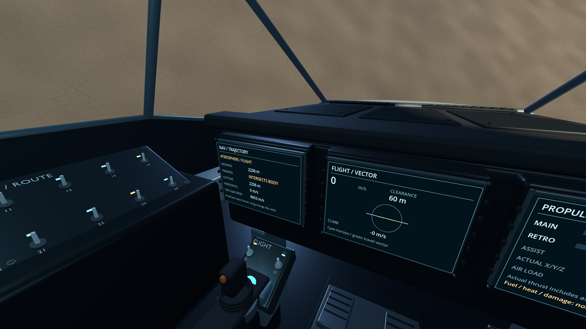
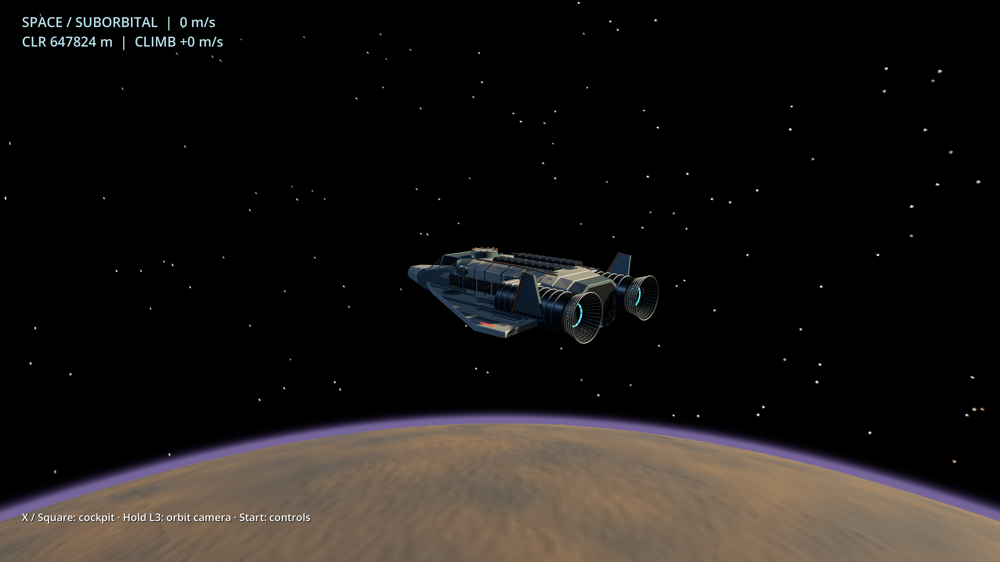
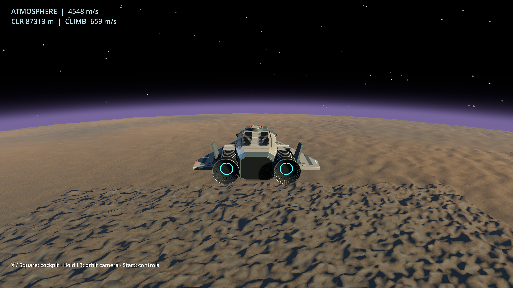

# Flight presentation 10: instruments, stars and orbital practice

Follow-up: [terrain continuity review 11](TERRAIN_CONTINUITY_11.md) addresses
the sharp lighting/detail boundary seen during high-altitude playtesting.

2026-09-18. Opt-in, unsaved native experiment, not a release or the completed
Freedom milestone. C++ remains authoritative; terminal simulation, generators,
saves, replays and controller layout 4 are preserved.

## Playtest

```sh
tools/run_godot_study.sh --stream=true --relief=true --pilot=true \
  --flight-model=thrust --start-paused=true
```

- Hold **left-stick click / L3**, move the right stick: cockpit head-look.
  Release snaps to center; center the right stick before yaw/heave rearm.
- **X / Square** changes cockpit/chase view. Outside, the same hold-look gesture
  orbits the camera; release smoothly returns behind the ship. Mouse users can
  hold RMB to orbit and scroll to zoom. Camera distance is also in settings.
- **Start / Options** opens settings. **Engineering diagnostics**, or keyboard
  **F3**, toggles the debug wall. Normal cockpit view has no persistent overlay;
  safety and neutral-control messages can still appear.
- **Y / Triangle** toggles translation/gravity assist. Turn it **off** for an
  unpowered orbit: gravity compensation changes the trajectory.
- **Orbit practice** explicitly relocates the unsaved flight to a circular
  250 km orbit. **Re-entry practice** relocates to 90 km with 4,500 m/s horizontal
  and 650 m/s downward velocity. These are testing shortcuts, not automatic
  orbit insertion. Selection leaves the game paused; resume when ready.
- **Reset experimental flight** returns to the original near-surface start.

RT/LT (R2/L2) remain main/retro, left stick pitch/roll, right stick yaw/heave,
and LB/RB (L1/R1) lateral translation. No automatic atmospheric remapping.
R3 remains free; boost and animated thrusters are not implemented. Keyboard
equivalents are in settings and [lab 09](THRUST_FLIGHT_LAB_09.md).

## Working panels

The three existing display bezels hold read-only C++ telemetry, updated at 10 Hz:

| Panel | Information |
| --- | --- |
| NAV | Phase, apoapsis/periapsis altitude, horizontal and circular speed |
| FLIGHT | Speed, terrain clearance, attitude, actual travel direction, climb |
| PROPULSION | Main/retro actuation, assist, body-axis thrust, air load |

The velocity marker distinguishes movement from nose direction. No invented
fuel, heat or damage readings. A negative periapsis reads **INTERSECTS BODY**.
These are two-body coast predictions; thrust and drag change them. A clear
orbit must be bound and its periapsis above both the modeled atmosphere edge
and 20 km altitude. Merely flying high is not acquiring an orbit.



Original GLBs are unchanged. The instrument quads fit revision-5 bezels; static
artwork remains in historical inspection/film modes. They are not yet clickable
switch systems.

## Stars and planetary view

C++ derives 1,536 stable system seeds in an isolated **preview sky catalog v1**
namespace. Existing local-system generation supplies star colors; independent,
decorrelated named samples supply directions/brightness. Godot consumes this
catalog, not another random universe. Stars stay anchored to the planet-fixed
frame while the local terrain frame changes.

This is an identity-backed preview, **not yet a navigable galaxy**: there are
no physical star distances, jump routes or target-selection UI. A future shared
galaxy catalog must explicitly preserve/version this boundary.

The once-generated 4096×2048 RGB8 runtime sky uses 24 MiB of image data before
engine/GPU overhead; no sky bitmap is shipped. A short analytic atmosphere
integration fades stars, occludes them behind the planet and supplies a colored
limb. It is not weather or re-entry plasma.



This frame is an explicit, stationary **650 km inspection relocation**, correctly
labeled suborbital; it does not prove ascent by flight.

Separate near-ship and distant-terrain cameras share the same world/pose. Their
composited depth ranges preserve cabin precision while showing the planetary
horizon. A C++ terrain probe keeps the chase-camera endpoint above ground;
this is not ship collision or a complete swept-camera occlusion solver.

## Continuous journey evidence

`flight_journey_test.cpp` uses a **test-only pilot**, issuing the normal seven
actuator demands at 120 Hz. It starts stationary 60 m above real seed-42
procedural terrain (relief 1, LOD 8), ascends, acquires a coastable orbit, coasts
unpowered for 120 seconds, turns for a main-engine braking burn and descends
through the atmosphere to 10 km. Every tick samples the same C++ terrain.
No mid-journey position/velocity injection or floor-guard contact is permitted.
This is not a gameplay autopilot, and the test does not include landing.

Both GCC and Clang reported:

| Event | Simulated time / state |
| --- | --- |
| Clear orbit | 378.183 s; altitude 245,571 m; peri/apo 122,855 / 259,814 m |
| Atmospheric return | 1,758.52 s |
| Descending through 10 km | 2,223.54 s; speed 381.443 m/s |
| Peak altitude / air load | 255,443 m / 198,973 Pa |

That roughly 37-minute journey is physics evidence, not an endorsement of final
travel pacing. Practice starts make short controller checks possible.



GPU presentation checks passed at 1080p and 4K with direct PNG inspection:
live panels, clean/debug modes, orbit camera/recentering, zoom, sky and practice
starts. Separate synthetic controller checks passed flight, look, remapping,
menus, focus, neutral gate and hotplug. These do not establish physical pad
feel, SteamOS qualification or sustained frame-rate benchmarks.

Both compilers passed five `godot-.*-contract` CTests. Both actual extension
builds passed `input_test.gd`, `live_test.gd` and `thrust_test.gd`, including
nonfinite/buffer rejection, invalid camera probes, deterministic star identities,
practice isolation and legacy replay checks. Prior
[numerical compatibility findings](NUMERICAL_COMPATIBILITY_FINDING.md) remain
separate; no historical golden was rewritten.

## Remaining work

Terrain detail changes too abruptly between LOD bands, conspicuously during
re-entry. Stars are a first bounded presentation, not a finished cinematic sky.
Atmosphere physics still lacks wing lift, wind, heating and Mach-dependent
coefficients. The lab has unlimited propellant, no damage and a **16 m test
floor guard**, not landing. Low-altitude orbital predictions are not a terrain
collision forecast.

After handling/orbit playtesting: terrain contact, localized functional ship
damage, and an explicit fractured-viewglass demonstration. Audio should then
follow the same state: interior structure-borne propulsion, pumps/ventilation;
additional atmospheric airflow/buffeting; localized wear/fault cues. That is
design direction, not audio implemented here. Preserve the existing MIDI and
First Light work; a flight proof need not require an orchestral score.

## Reproduce

With the study configured/built and the matching exported fixture (see the
[study README](../experiments/godot-freedom/README.md)):

```sh
ctest --test-dir build -R 'godot-.*-contract' --output-on-failure
godot --headless --path experiments/godot-freedom --script res://thrust_test.gd \
  -- "$PWD/build-godot/snapshot-42-stream-true.json"
mkdir -p build-godot/presentation-review
godot --path experiments/godot-freedom --script res://presentation_smoke.gd -- \
  --snapshot="$PWD/build-godot/snapshot-42-stream-true.json" \
  --assets="$PWD/assets/visual" --stream=true --flight-model=thrust \
  --pilot=true --start-paused=true --controls-persist=false \
  --render-size=3840x2160 --review-dir="$PWD/build-godot/presentation-review"
```

Repeat with a separate Clang build and its staged extension. PNGs have adjacent
JSON identifying inspection relocations and flight state. Selected documentation
captures are original BSD-3-Clause assets recorded in `assets/provenance.json`.
