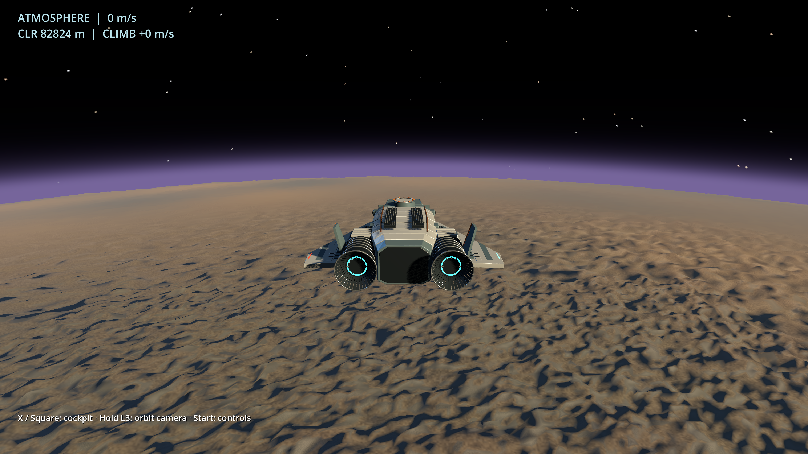
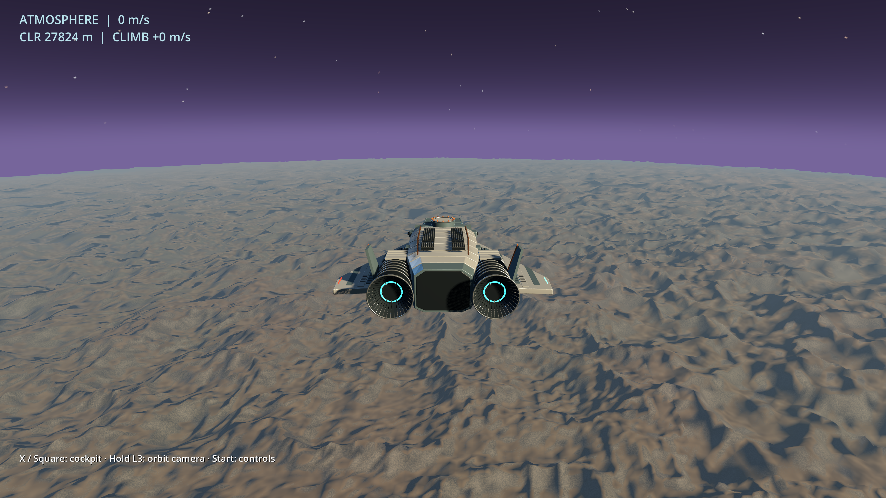

# Terrain continuity review 11

2026-09-18. A focused native presentation refinement following the owner's
high-altitude playtest, not a new terrain generator or a completed planetary
renderer. Controls, surface heights, seeds, collision sampling and flight
forces are unchanged.

## Change

The previous streaming mesh switched from geometric normals to high-detail
surface normals at LOD 7. That made the nearby tiles look like a dark, sharply
bounded patch even though both sampled the same world.

The same C++ surface-normal recipe now extends through LOD 5. Fine slope shading
fades continuously with camera distance between 120 and 500 km, instead of
changing at a tile boundary. Slope-dependent material coloring uses that same
filtered normal. Close terrain retains its existing detail. This is an authored
presentation filter, not atmospheric scattering or a different physical surface.

An initial, shorter fade erased too much visible relief and was rejected after
render inspection. A review-script timing bug also exposed that a stationary
capture could precede completion of the new terrain cover; the new script waits
for a replacement, an idle worker and completed GPU uploads before capturing.
Paused survey relocations now initialize air density so their phase label does
not incorrectly claim space at atmospheric altitudes.

## Review and tests

The native review script visits 2.5, 30, 85, 180 and 650 km, then returns to 85 km.
These are stationary inspections, **not continuous flight evidence**. The
continuous flight proof remains in [presentation 10](FLIGHT_PRESENTATION_10.md).
The complete inspection sequence passed at 3840×2160, including a return to
231 resident tiles at 85 km after the 650 km cover used 141. The existing
1080p moving-flight/panels/camera/practice integration test also passed with
zero failures and no shader or script errors.

New C++ checks compare identical shared surface positions and normals across
LOD 5/6, 6/7 and 7/8 boundaries, and exact normal regeneration after cache
eviction. Existing invalid-input, finite/index-boundary, full planetary cover
and resident-memory checks remain. Both GCC and Clang pass the five native C++
contracts and the actual extension's thrust tests, including paused survey
telemetry. The tile budget remains 384; extending normal sampling increases
worker cost, not the maximum resident mesh count.

To reproduce captures, create a review directory and run
`res://terrain_transition_review.gd` with the same snapshot/assets/stream/thrust
arguments as `presentation_smoke.gd`, adding `--review-dir` and optionally
`--render-size=3840x2160`. PNG sidecars contain state, residency and license
metadata. Captures are BSD-3-Clause original Godot renders, not generated
concept art or sustained performance benchmarks.

## Next visual decisions

This pass addresses the conspicuous **lighting/detail boundary**, not all LOD
problems. Mesh replacements still use skirts and atomic cover swaps rather
than geometric morphing; large landforms and physically informed atmospheric
depth still need work. Distant terrain can look too smooth. Review the balance
before adding more detail or making another generator version.

The visual reference is original EVERSPACE's colorful, hyper-real direction,
not a promise to reproduce its assets. [ROCKFISH's developer interview](https://80.lv/articles/everspace-interview)
describes this distinction. The next priorities are coherent landforms,
silhouette/lighting contrast and state-driven propulsion feedback. Preserve
the current direct-roll controls; an optional shooter-style preset should be
playtested separately, informed by [the original game's developer guidance](https://steamcommunity.com/app/396750/discussions/0/2565312892652512472/).
